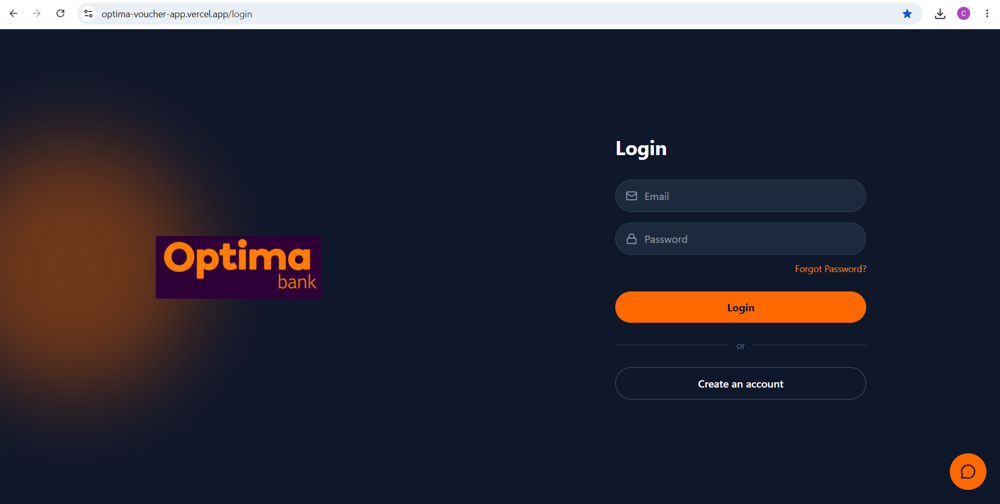
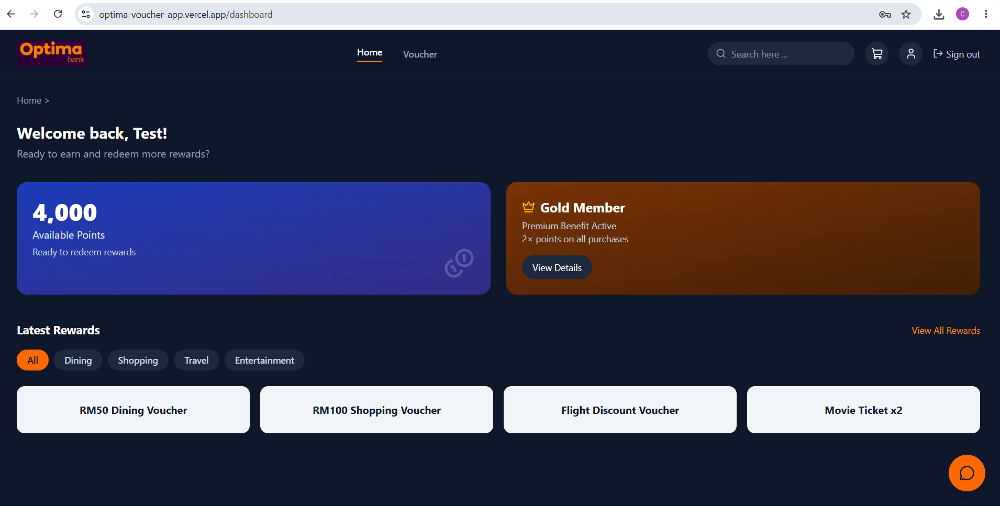
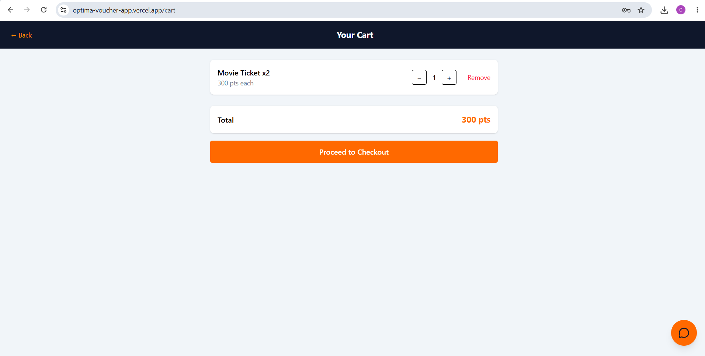

# Optima Bank — Voucher Rewards App

A full-stack voucher redemption platform built for Optima Bank, where users earn and redeem points for real-world rewards (dining, shopping, travel, and entertainment vouchers).

**🔗 Live demo:** https://optima-voucher-app.vercel.app

> Note: the backend runs on Render's free tier and may take 30-60 seconds to wake up on first load if it's been idle.

---

## 📸 Screenshots

<!-- Replace these with actual screenshots once you have them saved -->
| Login | Dashboard | Checkout |
|---|---|---|
|  |  |  |

---

## ✨ Features

- **Authentication** — email/password signup and login secured with JWT tokens and BCrypt password hashing
- **Voucher browsing** — category filtering, search, and detailed voucher views
- **Shopping cart** — add, adjust quantity, and remove vouchers before checkout
- **Points-based redemption** — atomic checkout transaction that deducts points, decrements stock, and logs the redemption — safely, even under concurrent requests
- **PDF generation** — each redeemed voucher can be downloaded as a PDF receipt
- **User profile** — editable name and gender, profile picture upload, and password change
- **In-app help chatbot** — a guided assistant widget answering common questions about how the app works
- **Toast notifications** — real-time feedback for every action (success/error), instead of static inline text
- **Fully responsive** — built mobile-first with Tailwind CSS

---

## 🏗️ Architecture

```
┌─────────────────┐         ┌──────────────────┐         ┌─────────────────────┐
│   Vercel         │  HTTPS  │   Render          │  SQL    │   Azure SQL          │
│   (Frontend)     │────────▶│   (Backend API)   │────────▶│   Database           │
│   React + Vite   │         │   ASP.NET Core    │         │                      │
└─────────────────┘         └──────────────────┘         └─────────────────────┘
```

The frontend and backend are fully decoupled — React communicates with the ASP.NET Core Web API purely over JSON/REST, with no server-rendered pages. Authentication state is carried via a JWT bearer token attached to every request after login.

---

## 🛠️ Tech Stack

**Frontend**
- React + TypeScript
- Vite
- Tailwind CSS
- React Router
- Axios
- lucide-react (icons)

**Backend**
- ASP.NET Core Web API (.NET 10)
- Entity Framework Core
- JWT Bearer Authentication
- BCrypt.Net (password hashing)
- QuestPDF (PDF generation)

**Database**
- SQL Server (Azure SQL Database in production)

**Infrastructure**
- Frontend hosting: Vercel
- Backend hosting: Render (Docker deployment)
- Database hosting: Azure SQL Database
- Version control / CI trigger: GitHub

---

## 🚀 Running Locally

### Prerequisites
- .NET SDK 8+
- Node.js 20+
- SQL Server (local instance or Docker)

### Backend
```bash
cd OptimaVoucherApi
cp appsettings.Example.json appsettings.json
# edit appsettings.json with your own local SQL Server connection string and a JWT secret
dotnet ef database update
dotnet run
```
The API runs at `http://localhost:5215` (check your console output for the exact port).

### Frontend
```bash
cd optima-voucher-web
npm install
npm run dev
```
The app runs at `http://localhost:5173`.

> Make sure `src/api/client.ts`'s `baseURL` points at your local backend port when running locally.

---

## 📁 Project Structure

```
optima-voucher-app/
├── OptimaVoucherApi/          # ASP.NET Core backend
│   ├── Controllers/           # API endpoints (Auth, Vouchers, Cart, Redemption)
│   ├── Models/                # Entity classes (User, Voucher, CartItem, RedemptionLog...)
│   ├── DTOs/                  # Request/response data shapes
│   ├── Data/                  # EF Core DbContext
│   ├── Services/              # PDF generation
│   └── Dockerfile
└── optima-voucher-web/        # React frontend
    ├── src/
    │   ├── pages/              # One component per screen
    │   ├── components/         # Reusable pieces (ChatWidget, etc.)
    │   ├── context/             # Auth + Toast global state
    │   ├── api/                 # Axios calls to the backend
    │   └── types/                # Shared TypeScript interfaces
    └── vercel.json
```

---

## 🧠 What I Learned

This was my first full end-to-end full-stack project, built from a client's design spec and wireframes through to a live, deployed application. Along the way I worked through:

- Structuring a REST API around clear resource boundaries (Auth, Vouchers, Cart, Redemption)
- Using database transactions (`BeginTransactionAsync`) to keep a multi-step operation (checkout: deduct points, reduce stock, log the redemption) safe from partial failures and race conditions
- JWT-based stateless authentication, and the difference between frontend route protection (UX) and backend `[Authorize]` enforcement (actual security)
- Debugging real deployment issues: CORS misconfiguration, cloud database firewall rules, SPA client-side routing 404s on refresh, and environment variable wiring across three different hosting platforms
- The tradeoffs of free-tier hosting (spin-down delays, ephemeral file storage) and how those constraints shape real design decisions

---

## 📄 License

This project was built as a learning exercise based on a provided design specification. Feel free to explore the code for reference.
